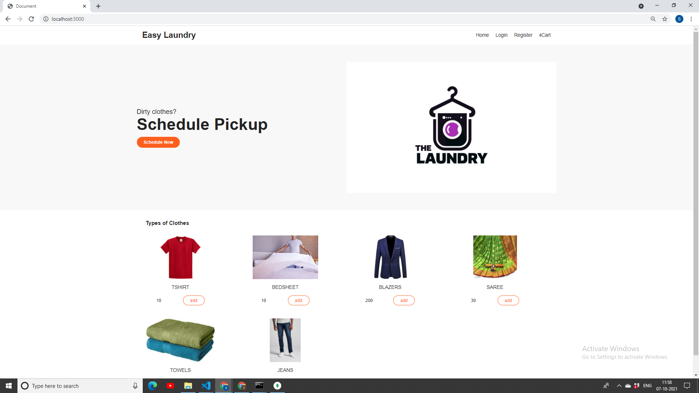
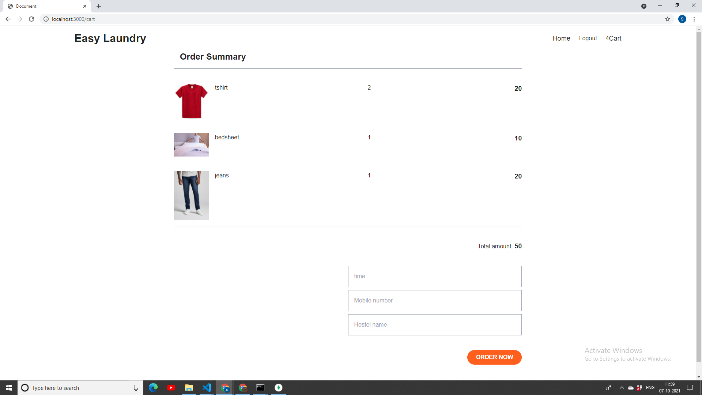
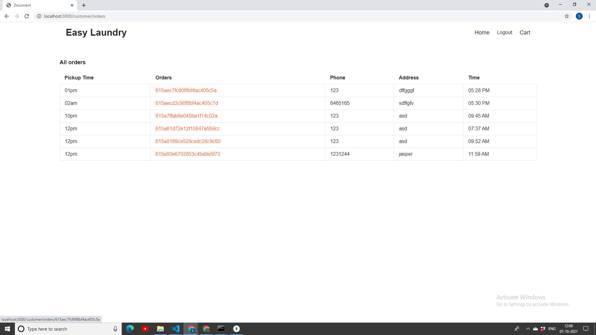
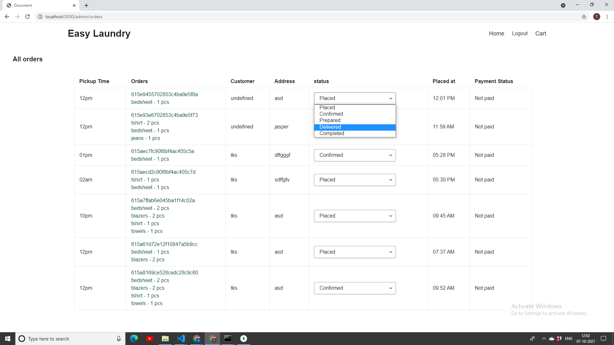
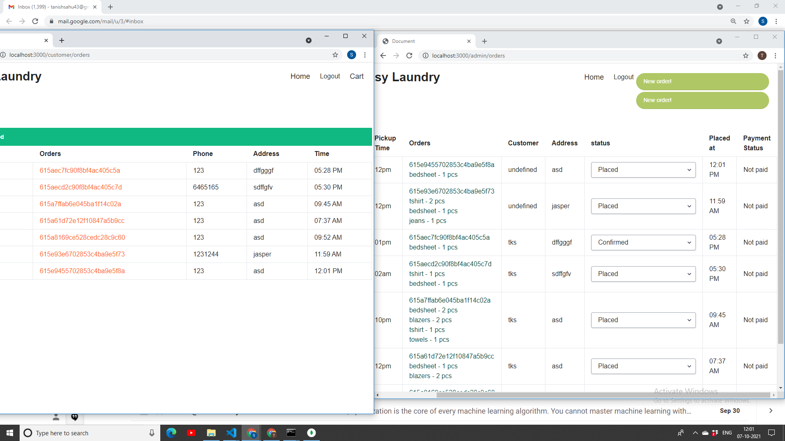

## Easy Laundry

Build a website for college laundry service with flexible individual scheduled clothes pickup ,real time order status notification , admin functionalities , add to cart feature.

Solved problems of long queues ,lost token cards,absence of students when washerman comes for cloth pickup.

## Tech Stack Used
### Backend
1. **MongoDB** - Document database for storing user data and informations about the properties.
2. **Nodejs** - Runtime Environment for javascript
3. **ExpressJS** - as a light, unopinionated application framework 
4. **Passport** - for user authentication strategies
6. **Socket.io** - for enabling realtime,status changes between clients and admin.

### Frontend
1. EJS
2. SCSS
3. Tailwind CSS
4. HTML

### To run on your localhost :
1. yarn watch
2. yarn dev
3. connect mongodb 

## Screenshots

## front page

## user cart:

## user orders page:

## admin dashboard to track all orders:

## Admin get notified whenever a new order is placed:

